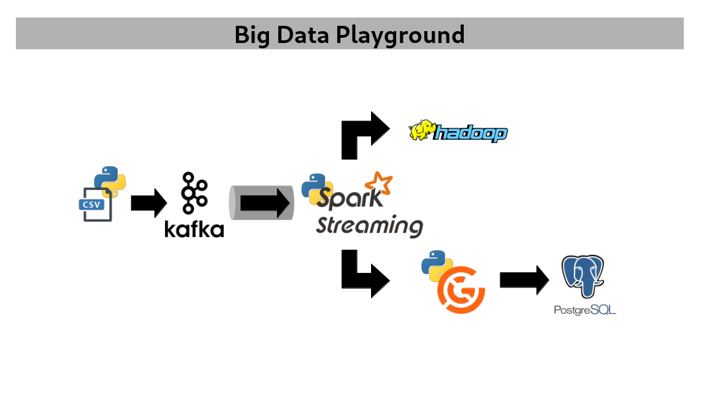

# Big Data Playground

This playground aims to expand knowledge in big data and real-time data tools.
It provides an environment for experimenting with various technologies and techniques in the fields of big data and real-time processing.

A roadmap is available [here](ROADMAP.md).

## Overview

### Data Source

- **Kaggle Dataset**: [IBM Transactions for AML](https://www.kaggle.com/datasets/ealtman2019/ibm-transactions-for-anti-money-laundering-aml)

### Data Feed

- **Kafka**: used for real-time data streaming

### Data Ingestion

- **Spark**: used for processing and analyzing data in real-time

### Data Validation

- **Great Expectations**: ensures data quality and integrity through automated testing

### Data Output

- **Hadoop**: used for storing raw and formatted data
- **PostgreSQL**: serves as data warehouse for storing processed and analyzed data

### Data Processing

- **MapReduce**
  - Hadoop MapReduce
  - Spark
